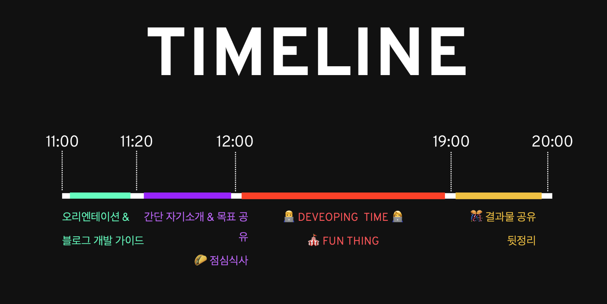
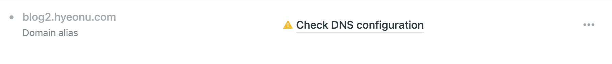

그동안 개인 블로그 셋업에 미련만 가지고 전혀 실천을 못하고 있었는데, 이번에 황지영 님의 소개로 [내집마련 블로그 해커톤](https://www.notion.so/be735a45ff444a48bd4a23a0a299e2e5)에 참여해서 숙원(?)을 이루게 되었다. 만든 블로그에 첫 포스팅도 할 겸 셋업 과정을 정리해서 남기려고 한다.


해커톤 타임라인

1. [Gatsby](https://www.gatsbyjs.org/)

Gatsby 는 마크다운과 이미지 파일 등의 소스로부터 정적 사이트를 생성해 주는([static site generator](https://www.staticgen.com/)) 도구이다. 마크다운 파일을 django 등의 웹 서버가 들고 있다가 매 요청마다 변환해서 제공할 수도 있겠지만 이럴 경우 내가 직접 서버를 셋업해서 돌려야 한다. 반면 html, css, js 등의 정적 파일로 구성된 웹사이트를 최소한의 설정으로 잘 서빙해 주는 서비스는 여러 곳이 있고, 보통 개인 블로그용으로 쓰는 정도는 무료로 사용할 수 있어서 가볍게 만들어 볼 수 있다. 하지만 매 포스팅의 html 태그를 손으로 한땀한땀 깎는걸 좋아하는 사람은 아무도 없으므로 보통은 마크다운 등의 문법으로 게시글을 작성하고 이를 정적사이트 생성기로 처리해서 배포하는 것이다.

아무래도 Gatsby 의 주 사용처가 블로그인 만큼, 공식 지원되는 [gatsby-starter-blog](https://www.gatsbyjs.org/starters/gatsbyjs/gatsby-starter-blog/) 를 사용하면 큰 고민 없이 그럴듯해 보이는 블로그를 만들 수 있다.

```sh
$ npm install -g gatsby-cli
$ gatsby new my-blog-dir-name https://github.com/gatsbyjs/gatsby-starter-blog
$ cd my-blog-dir-name
$ gatsby develop
```

이제 `content` 디렉터리 밑의 더미 데이터를 날리고 내 사진과 게시글로 채워넣으면 된다. Footer 등에 원저자의 신상정보가 들어있으니 이것도 고쳐주자. 한글 포스팅을 하려면 관련 폰트도 추가해 주어야 한다. `Nanum Gothic` 정도면 나쁘지 않다.

1. [Netlify](https://www.netlify.com/)

Netlify 는 정적 사이트 호스팅 서비스이다. 물론 그 뿐이라면 시장에 경쟁자가 넘치므로(AWS S3 역시 정적사이트 호스팅이라고 볼 수 있다) 정적사이트와 함께 사용 가능한 여러 기능들을 제공하고 있는데, 그 중 하나가 바로 "정적 사이트 자동 빌드" 기능이다. 위에 적었듯 정적 사이트 생성기는 마크다운 등의 원본파일을 정적 사이트로 변환하는 과정을 거쳐야 하는데, 이걸 매번 로컬에서 돌리는건 상당히 귀찮은 일이다. 하지만 Netlify 를 사용할 경우 작성한 마크다운 게시글을 Github 에 push 하면 Netlify 에서 해당 이벤트를 받아 재빌드 후 배포까지 자동으로 해 준다.

우선 아까 셋업한 Gatsby 저장소를 Github 등의 공개 저장소에 올려야 한다. Netlify 는 Github, Gitlab, BitBucket 등을 지원한다. Netlify 에 회원가입 후 안내대로 확인을 누르다 보면 `https://clever-montalcini-f82af2.netlify.com/` 같은 이상한 주소에 내 블로그가 만들어졌다는 창을 볼 수 있다. 이 이상한 주소는 다른 사람과 겹치지 않는 선에서 변경 가능해 보이지만, 이왕이면 몇년 전에 사놓고 매년 이용료만 내고 있는 개인 도메인 주소를 쓰는 편이 좋을 것이다. `Settings > Domain management > Custom domains` 로 가서 `Add domain alias` 를 등록해 주자. 그러면 노란색 경고 표지가 보일 것이다.



왜 이런 경고가 뜨는 걸까? 방금 내 개인 도메인 주소가 Netlify 로 연결된다는 사실을 Netlify 에게 알려주었지만, DNS 서버에는 알려주지 않았기 때문이다. 웹 브라우저가 특정 도메인으로 접속하려면 우선 DNS 서버에게 해당 도메인 주소가 어느 IP 주소에 연결되는지 물어보고, 응답받은 IP 주소로 실제 요청을 보내게 된다. DNS 서버에 변경 사실을 알려주지 않을 경우 마치 치킨집에서 전화번호를 바꿨지만 바뀐 전화번호를 배달앱에는 등록하지 않은 것처럼 웹 브라우저에서는 바뀐 주소로 블로그에 접속할 방법이 없는 것이다.

우선 내 도메인 주소가 등록된 DNS 제공 서비스에 접속해야 한다. 보통 NameCheap/GoDaddy 등의 도메인 등록 서비스 혹은 AWS/DigitalOcean 등 클라우드/서버호스팅 서비스에서 함께 제공하는 DNS 서비스를 쓰고 있을 것이다. 도메인 구매 후 딱히 관련해서 뭔가를 한 기억이 없다면 도메인을 구입한 사이트에서 DNS 서비스를 찾아보자. 찾았다면 해당 도메인에 CNAME 레코드를 추가하면 된다. `Hostname` 에는 블로그에 사용할 서브도메인 주소를, `Value` 에는 아까 그 길고 이상한 주소를 `clever-montalcini-f82af2.netlify.com.` 같은 포맷으로 넣으면 된다.

자, 이렇게 해서 마크다운으로 게시글을 작성해서 Github 에 push 만 하면 자동으로 갱신되는 개인 도메인 블로그를 가지게 되었다. 하지만 인터넷을 통한 도/감청이 나날이 심각해지고 개인정보의 중요성이 대두되는 이 시국에 암호화되지 않은 블로그를 만드는 것이 과연 현명한 일일까? 다행히도 Netlify 는 [LetsEncrypt](https://letsencrypt.org/) 를 통한 무로 HTTPS 지원을 자동으로 제공한다. 다만 이 과정은 도메인 설정이 끝나고도 약 한 시간 정도가 더 걸리니 느긋하게 기다렸다가 `https://` 주소로 블로그에 접속이 가능한지 꼭 확인해 보자.
